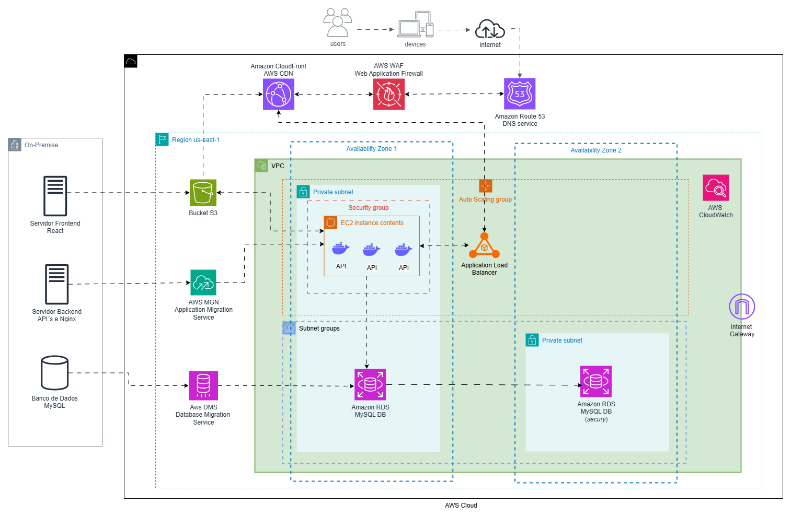
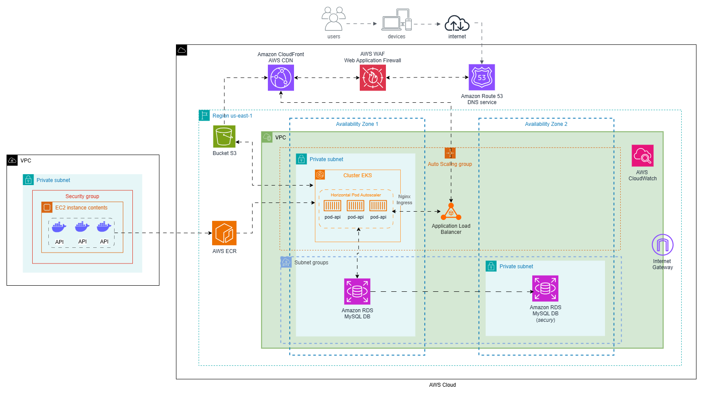

# Arquitetura AWS para Fast Engineering S/A

## Visão Geral

A Fast Engineering S/A enfrenta desafios com sua infraestrutura on-premise devido ao crescimento acelerado do eCommerce, que não suporta mais a alta demanda de acessos e compras. Para modernizar a infraestrutura, garantir escalabilidade, alta disponibilidade e segurança, será realizada uma migração para a Amazon Web Sservice em duas etapas: uma migração inicial "As-Is" para garantir continuidade operacional, seguida pela modernização da arquitetura utilizando Kubernetes.

---

## Objetivos

* **Migrar a infraestrutura atual para a AWS** de forma rápida e segura, utilizando uma abordagem "Lift-and-Shift" (As-Is) para minimizar interrupções.
  
* Modernizar a arquitetura após a migração inicial, adotando **Kubernetes** para garantir escalabilidade automática, alta disponibilidade e resiliência.
  
* Garantir **alta disponibilidade e segurança** do sistema, atendendo às demandas crescentes do eCommerce.

* Adotar um banco de dados gerenciado (PaaS) com suporte a Multi-AZ (Zonas de Disponibilidade)

* Estabelecer uma **política de backup de dados**, garantindo a integridade e a recuperabilidade das informações em caso de falhas ou perdas.

* Implementar um sistema de **persistência de objetos** para armazenamento eficiente de mídias (imagens, vídeos, etc.), com alta disponibilidade e escalabilidade.

---

### 1. Ordem de Migração Recomendada

1. Banco de Dados

2. Backend

3. Frontend

A ordem de migração entre **frontend**, **backend** e **banco de dados** é essencial para garantir que a aplicação continue funcionando corretamente durante e após a migração. A abordagem recomendada é migrar o banco de dados primeiro, seguido pelo backend e, finalmente, o frontend.

#### 1.1. Migração do Banco de Dados
**Por que começar pelo banco de dados?**

O banco de dados é onde todos os dados críticos são armazenados. Migrar o banco de dados primeiro permite que o backend e o frontend continuem funcionando com o banco de dados original durante a migração.
Uma vez que o banco de dados esteja migrado e validado, o backend e o frontend podem ser atualizados para apontar para o novo banco de dados na AWS.

---

#### 1.2. Migração do Backend
**Por que migrar o backend em seguida?**

O backend depende do banco de dados para funcionar corretamente.
Com o banco de dados já migrado e validado, o backend pode ser migrado com a confiança de que os dados estão disponíveis e acessíveis.

---

#### 1.3. Migração do Frontend
**Por que migrar o frontend por último?**

O frontend depende do backend para funcionar corretamente. Com o backend já migrado e validado, o frontend pode ser migrado com a confiança de que as APIs estão disponíveis e funcionando.
#

---

### 2. Componentes da Arquitetura

#### 2.1. Frontend (React)
- **Amazon S3**: Armazena os arquivos estáticos do frontend (HTML, CSS, JavaScript).
- **Amazon CloudFront**: Distribui o conteúdo do S3 globalmente, reduzindo a latência e melhorando o desempenho.
- **Amazon Route 53**: Gerencia o DNS do domínio.

---

#### 2.2. Backend (APIs)
- **AWS Application Migration Service (MGN)**: realizar a migração do backend local para a AWS.
- **Amazon EC2**: lançar Instância EC2 que hospeda as APIs em contêineres Docker.
- **Application Load Balancer (ELB)**: distribui o tráfego entre as instâncias EC2 do backend.
- **Auto Scaling**: ajusta o número de instâncias EC2 com base na demanda.

---

#### 2.3. Banco de Dados
- **AWS Database Migration Service**: migrar o banco de dados MySQL local para o Amazon RDS com o mínimo de tempo de inatividade.
- **Amazon RDS**: Banco de dados MySQL em configuração Multi-AZ para alta disponibilidade.

---

#### 2.4. Armazenamento de Objetos
- **Amazon S3**: Armazena arquivos estáticos, como imagens e vídeos.

---

#### 2.5. Segurança
- **Amazon Virtual Private Cloud (VPC)**: Isola os recursos em subnets públicas e privadas.
- **Security Groups**: Controlam o tráfego de rede.
- **AWS Web Application Firewall (WAF)**: Protege as APIs e o CloudFront contra ataques comuns na web.
- **AWS Shield**: Protege contra ataques DDoS.

---

#### 2.6. Monitoramento
- **Amazon CloudWatch**: Monitora métricas (CPU, memória, tráfego de réseau) e coleta logs.

---

### 3. Diagrama de Arquitetura 

---
#
### 4. Etapas de migração

#### 4.1. Migração do Banco de Dados com AWS Database Migration Service (DMS)

**1. Criar uma instância do Amazon RDS com o MySQL:**

  * Instance Class: db.m5.large (2 vCPUs, 8 GB de RAM).

  * Multi-AZ: Habilitar para alta disponibilidade.

  * 500 GB com provisionamento de IOPS.

  * Habilitar backups automáticos.

**2. Criar uma Instância de Replicação do DMS:**

  * Instance Class: dms.t3.medium (2 vCPUs, 4 GB de RAM).

  * VPC: Associar à VPC onde o RDS está localizado.

  * Subnet Group

**3. Configurar dois Endpoints:**
  * Endpoint de origem: especificar as cofigurações do banco de dados local.
  * Endpoint de destino: especificar as configurações da instância MySQL criada no RDS.

**4. Criar e Executar uma Tarefa de Migração:**

  * Criar uma tarefa de migração no DMS utilizando os endpoints criados anteriormente, a instância de replicação e configurada para replicar os dados do banco de dados local para o RDS. 
  * Usar **Change Data Capture (CDC)** para replicar alterações em tempo real durante a migração.

---

#### 4.2 Migração do servidor backend com AWS Aplication Migration Service (MGN)

**1. Instalar o AWS Replication Agent:**

* O **AWS Replication Agent** deve ser instalado nos servidores que hospedam o backend (APIs + Nginx) parra replicar os dados dos servidores para a AWS. O agente é compatível com sistemas operacionais Linux e Windows.

**2. Configurar o AWS MGN:**

* No console da AWS, criar um Source Server para o servidor backend.

* O **AWS MGN** detecta automaticamente os servidores com o agente instalado.

**3. Configurar as Launch Settings:**

Essa configuração define como os servidores serão lançados na AWS. Por exemplo:

* **Instance Type:** t3.medium (tipo de instância EC2). 

* **Subnet**: Associe a uma subnet na VPC onde o RDS e outros recursos estão localizados.

* **Security Groups:** Configure Security Groups para controlar o tráfego de entrada e saída.

**4. Teste de Migração**

* **Test Cutover**

  * O Test Cutover no AWS MGN é usado para lançar servidores de teste na AWS. Os servidores de teste são cópias exatas dos servidores de origem, mas não afetam a operação dos servidores de produção.

* **Validar os Servidores de Teste:**
  
  * É necessário acessar os servidores de teste e validar que as APIs e o Nginx estão funcionando corretamente.

  * Testar a integração com o banco de dados RDS

**5. Execução do Cutover**

* Após validar os servidores de teste, deve-se executar o Cutover para migrar os servidores de produção para a AWS.

* O AWS MGN desliga os servidores de origem e lança os servidores replicados na AWS.

**6. Configurar o Application Load Balancer (ALB):**

* Criar um **ALB** para distribuir o tráfego entre as instâncias EC2 escaláveis.

* Configurar **listeners** para HTTP (porta 80) e HTTPS (porta 443).

* Configurar o **health check** para monitorar a saúde das instâncias.

**7. Implementar Auto Scaling Group**

* Criar um **Template** com a mesma configuração da instância criada na migração com o serviço AWS MGN.

* Associar o ALB ao Auto Scaling Group.

*  Escalar de 1 para 2 instâncias EC2 com base no uso de CPU conforme a demanda.

Segurança:

Revise as políticas de Security Groups e IAM para garantir que apenas os recursos necessários tenham acesso aos servidores.

---

#### 4.3. Frontend (React) com CloudFront, Bucket S3 e Route 53

**1. Amazon S3**

* Bucket S3:

    * **Criar um bucket S3:** o CloudFront precisa de uma origem para distribuir o conteúdo. No caso do frontend, a origem será um bucket no Amazon S3 que armazena os arquivos estáticos (HTML, CSS, JavaScript). 
    * Configurar **permissões** para acesso público somente aos arquivos estáticos do frontend.
    * Gerenciar os arquivos de produção do frontend no servidor de origem. Todos os arquivos necessários devem estar na pasta de build.
    * Realizer upload dos arquivos de frontend para o Bucket S3 criado.

#### Amazon CloudFront
* Distribuição CloudFront:

    * Criar uma **distribuição CloudFront** com o bucket S3 como origem.

    * Configurar o **redirecionamento** HTTP para HTTPS para garantir que os usuários acessem o site apenas por HTTPS.
    * **Origin Protocol Policy:** HTTPS Only. Para garantir que o tráfego entre o CloudFront e o S3 seja seguro.
    * Habilitar o **AWS Web Application Firewall (WAF)** na distribuição CloudFront para proteção contra ataques.

#### Amazon Route 53
* Registro DNS
  * Criar um registro DNS do tipo IPv4 e distribuição do CloudFront.

---

## Arquitetura da Modernização 

### 1. Ferramentas utilizadas 

* **Dockerfile​:**  é um documento de texto que contém todos os comandos que um usuário pode chamar na linha de comando para montar uma imagem.

* **Amazon Elastic Container Registry (ECR)​:** um registro de contêiner totalmente gerenciado que oferece hospedagem de alta performance para que você possa implantar imagens e artefatos de aplicações de forma confiável

* **Amazon Elastic Kubernetes Service (EKS)​:** o Amazon EKS é um serviço do Kubernetes totalmente gerenciado que permite executar o Kubernetes facilmente na Nuvem AWS

* **Nginx Ingress Controller:** ​é uma implementação do Ingress Controller para NGINX e NGINX Plus que pode balancear a carga de aplicativos
 
* **AWS Load Balancer Controller (LBC)​:** é um controlador que provisiona balanceadores de carga da AWS que realizam o direcionamento para os recursos Service ou Ingress do cluster.

* **Horizontal Pod Autoscaler (HPA):​** o HPA do Kubernetes escala automaticamente o número de pods em uma implantação, um controlador de replicação ou um conjunto de réplicas com base na utilização da CPU desse recurso.

* **Cluster Autoscaler:**​ é uma solução popular de escalonamento automático de clusters mantida pelo SIG Autoscaling. Ele é responsável por garantir que seu cluster tenha nós suficientes para programar seus pods sem desperdiçar recursos.

* **Amazon CloudWatch​:** é um serviço que monitora aplicações, responde às mudanças de desempenho, otimiza o uso de recursos e fornece insights sobre a integridade operacional

* **AWS Identity and Access Management (IAM)​:** é um recurso da AWS desponibilizado de forma gratuita. Com o AWS IAM, é possível especificar quem pode acessar quais serviços e recursos da AWS e em que condições.

* **Kubernetes Role-based access control (RBAC)​:** é um método de regulação do acesso a recursos de computador ou rede com base nas funções de usuários individuais 

* **AWS WAF​:** com o AWS WAF, é possível criar regras de segurança que controlam o tráfego de bots e bloqueiam padrões de ataque comuns, como injeção de SQL. 

* **Velero:** é uma ferramenta de código aberto para fazer backup e restaurar com segurança, executar recuperação de desastres e migrar recursos de cluster e volumes persistentes do Kubernetes.

---

### 2. Diagrama da Arquitetura

---

### 3. Etapas de Modernização

#### 3.1. Enviar as API´s contanerizadas para o Amazon Elastic Container Registry (ECR) em Dockerfile.

#### 3.2. Criar um cluster no AWS EKS

* Configurar um Node Groups com instâncias EC2 adequadas 
  
* Configurar o Ingress Controller (Nginx) no cluster
  * Configurar regras de roteamento para as APIs.
  
* Configurar o AWS Load Balancer Controller:
  
  * Ele gerencia a criação e configuração do Application Load Balancer (ALB).
  * Configurar o ALB de modo que aponte para o Ingress Controller.
  * Configurar listeners para HTTP (porta 80) e HTTPS (porta 443).

#### 3.3. Migração das APIs para o EKS

* Criar Deployments para gerenciar as réplicas dos pods.

* Criar Services para expor as APIs internamente ou externamente.
  
* Configurar um Horizontal Pod Autoscaler (HPA)

  * Configurar o HPA para escalar os pods com base no uso de CPU ou memória.

#### 3.4. Auto Scaling Group (ASG)

* Configurar o ASG para escalar as instâncias EC2 com base na demanda de recursos.

* Integrar o ASG ao EKS:

  * O Cluster Autoscaler integra o ASG ao EKS ajustando o número de instâncias EC2 com base na demanda de pods.

#### 3.5. Monitorar com Amazon CloudWatch:

* Configurar métricas e alarmes para monitorar o desempenho das APIs (Uso de CPU, memória, tráfego de rede, erros HTTP).

#### 3.6 Backup e recuperação

* **Github e AWS CLI**:
  * Exportar as configurações do cluster EKS para um repositório de versionamento​

* **Velero**
  * O Velero faz backup de recursos do Kubernetes​

#### 3.7 Segurança

* **Segurança de Rede** ​
  * Configuração de **VPC** com subnets privadas para EC2 e RDS.​
  * **Security Groups** limitando acesso aos serviços.​

* **Proteção contra Ataques** ​
  * **AWS Web Application Firewall (WAF)** para mitigar ataques DDoS.​

* **Controle de Acesso** ​
  * Uso de **IAM Roles**, **Kubernetes Role-based access control (RBAC)** e políticas restritivas para acesso de usuários​

---

## Conclusão 

A migração da infraestrutura da Fast Engineering S/A para a AWS, seguida pela modernização com Kubernetes, representa um passo importante para superar os desafios atuais e garantir um ambiente escalável, seguro e altamente disponível. Ao adotar uma abordagem em duas etapas começando com uma migração "As-Is" para manter a continuidade operacional e evoluindo para uma arquitetura moderna e otimizada, o projeto assegura uma transição eficiente e com riscos minimizados.

Com a implementação de um banco de dados gerenciado, sistema de persistência de objetos, políticas de backup e segurança reforçada, a Fast Engineering S/A estará preparada para suportar o crescimento acelerado do eCommerce e atender às demandas futuras com maior eficiência e confiabilidade. Este projeto não apenas moderniza a infraestrutura, mas também posiciona a empresa para inovações contínuas, alinhadas às melhores práticas de cloud computing.